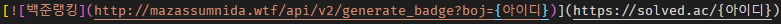

# 알고리즘 문제풀이 오픈소스 프로젝트(APOP)

**A**lgorithm **P**roblem-Solving **O**pen-Source **P**roject

 

## APOP 참여하기

기여하기 전 <a href="./CONTRIBUTING.md">CONTRIBUTING.md</a> 필수 확인 부탁드립니다.

 

## APOP CONTRIBUTORS는 이러한 마음가짐을 갖습니다.

<a href="./CODE_OF_CONDUCT.md">CODE_OF_CONDUCT.md</a>

 

## 기타 질문 사항은 여기로

질문 사항은 자유롭게 <a href="https://github.com/dongjji/Algorithm/issues">이슈</a>에 올려주시면 됩니다.

 

## 현재 참여중인 프로그래밍 언어

 
 
 

 

## 현재 풀이가 진행되고 있는 알고리즘 문제풀이 사이트

<a href="https://www.acmicpc.net/" style="color: black; text-decoration: none;">백준 온라인 져지(BOJ)</a>
<a href="https://programmers.co.kr/learn/challenges" style="color: black; text-decoration: none;">프로그래머스(Programmers)</a>

 

## 백준 티어 자랑하기(<a href="https://solved.ac/">solved.ac</a>)

#### <a href="./BOJ_RANK.md">백준 티어 자랑하기</a>

추가방법: 

